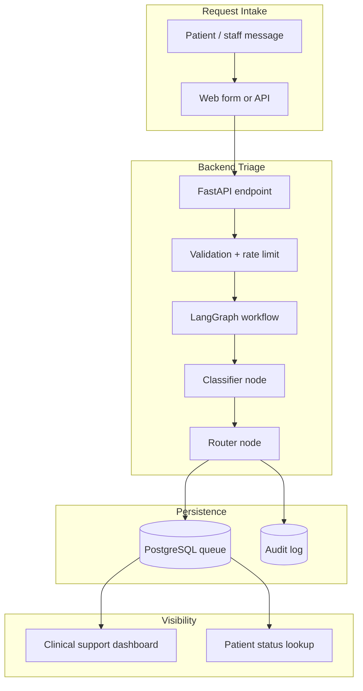
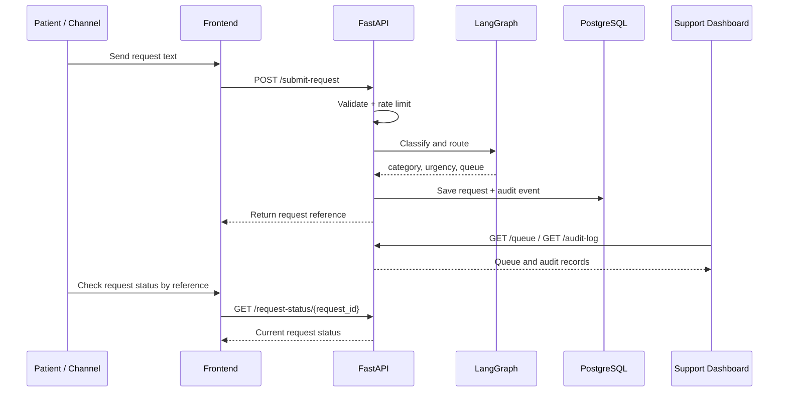
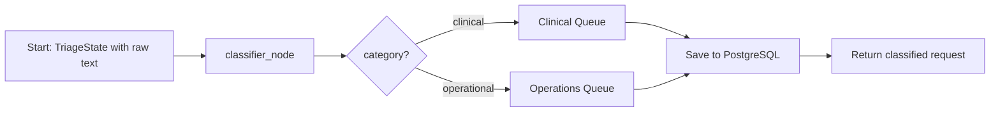

# Telemedicine Triage Workflow

## Purpose

This MVP is a telemedicine request triage system. It accepts plain-text requests, classifies them into a simple internal structure, routes them to the right queue, and lets clinical support review what happened. The patient can also check the status of a request by reference.

## System Overview

## Main Pieces

### Frontend

The React app is the UI for staff and patients.

It provides:
- a request submission box for new triage text
- a queue table for clinical support
- an audit trail view
- a patient-facing status lookup by request reference

Key frontend files:
- [frontend/src/App.jsx](frontend/src/App.jsx)
- [frontend/src/api.js](frontend/src/api.js)
- [frontend/src/components/QueueTable.jsx](frontend/src/components/QueueTable.jsx)

### Backend

The FastAPI app handles request intake, workflow execution, database writes, and lookup endpoints.

Key backend files:
- [backend/app/main.py](backend/app/main.py)
- [backend/app/api/routes.py](backend/app/api/routes.py)
- [backend/app/graph/triage_graph.py](backend/app/graph/triage_graph.py)
- [backend/app/services/classifier.py](backend/app/services/classifier.py)
- [backend/app/db/database.py](backend/app/db/database.py)

### Database

PostgreSQL stores:
- triage requests
- audit events
- current queue state

## LangGraph Flow

The LangGraph workflow is the core classification and routing logic inside the backend.

It uses a small state object:
- `request_id`
- `raw_text`
- `category`
- `urgency`
- `status`
- `queue_name`

How it works:
- `classifier_node` reads the raw message and assigns `category` and `urgency`.
- `router_node` uses the category to choose the queue name.
- The final state is written to PostgreSQL.
- The backend then returns the saved request to the caller.

## Workflow Logic

### 1. Request intake

A request can arrive from the web form or directly via the API.

The request text is sent to:
- `POST /submit-request`

Before processing, the backend checks:
- the text is not empty
- the text is not too long
- the caller is not exceeding the rate limit

### 2. Classification

The LangGraph workflow runs a classifier step.

The classifier assigns:
- `category`: `clinical` or `operational`
- `urgency`: `P1`, `P2`, or `P3`

If OpenAI is available, it uses the model.
If not, it falls back to a heuristic classifier.

### 3. Routing

After classification, the workflow routes the request into one of two queues:
- Clinical Queue
- Operations Queue

This is the internal grouping logic for the MVP.

### 4. Persistence

The classified request is saved in PostgreSQL.

The system also writes an audit event for every submit and approve action.

### 5. Review by clinical support

Clinical support uses the queue dashboard to see:
- what came in
- how it was classified
- what queue it landed in
- whether it is still pending or approved

### 6. Patient status lookup

Patients can use the request reference shown after submission to check status.

The frontend calls:
- `GET /request-status/{request_id}`

This returns the current record for that request.

## API Routes

### `GET /`

Health check for the backend.

Returns:
- service status
- app name

### `POST /submit-request`

Submits a new triage request.

Input:
- `raw_text`

Output:
- request ID
- category
- urgency
- queue name
- status

### `GET /queue`

Returns all queued requests for the support dashboard.

### `GET /request-status/{request_id}`

Returns a single request so a patient can check status.

### `POST /approve-request`

Marks a request as approved.

### `GET /audit-log`

Returns recent triage actions for transparency and debugging.

## Guardrails

The backend includes:
- request length validation
- rate limiting on submit and approve endpoints
- audit logging for every triage action
- fallback classification when the LLM is unavailable
- CORS restrictions for local frontend origins

## Important Assumptions

- This is a code-first MVP, not a full automation-platform build.
- No n8n or Zapier workflow was used in this implementation.
- Patients currently check status using the request reference number.
- In a production version, patient lookup would usually use authentication or a secure token.

## How to Explain It

You can explain the system in this order:

1. A patient submits a request from the web form or another channel.
2. The backend validates it and applies rate limits.
3. LangGraph classifies it into clinical or operational, and assigns urgency.
4. The request is routed to the correct queue.
5. PostgreSQL stores the request and the audit event.
6. Clinical support sees the queue and can approve the request.
7. The patient can check the status later using the request reference.

## What Makes It Scalable

- Small and stable grouping categories
- Clear separation between frontend, workflow, and persistence
- Audit trail for accountability
- LLM fallback for resilience
- Easy extension to additional channels later

## What Would Come Next

With more time, I would add:
- email and SMS notifications
- patient authentication
- more intake channels
- a real automation platform workflow
- better role-based access for staff
- metrics and reporting
